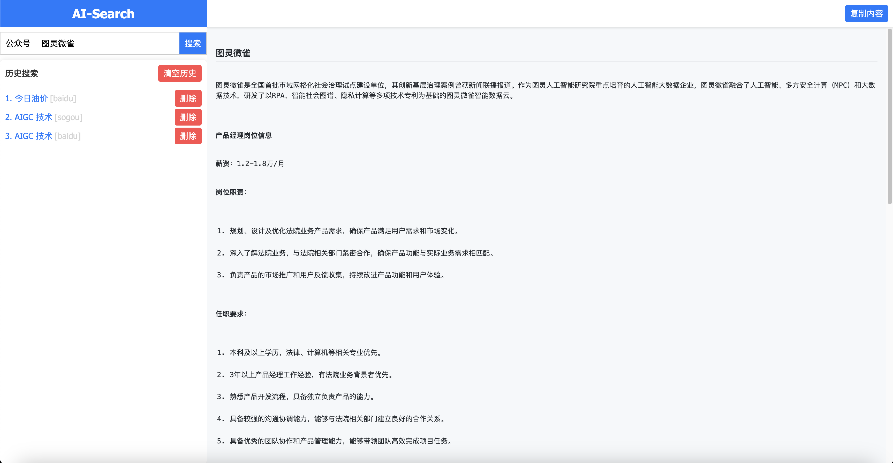

# AI-Search 项目

## 项目简介

AI-Search 是一个基于多搜索引擎的搜索和总结工具，用户可以选择不同的搜索引擎进行关键词搜索，并对搜索结果进行总结。

## 项目结构

```
/
├── front/                  # 前端代码
│   └── index.html          # 前端页面
├── server/                 # 后端代码
│   ├── html2md.py          # 后端服务
│   ├── utils.py            # 工具类
│   └── prompt_templates/   # 提示词模板
│       ├── keyword_prompt.txt
│       └── no_keyword_prompt.txt
├── snapshots/              # 截图存放目录
└── README.md               # 项目说明文件
```

## 使用方法

### 前端

1. 打开 `front/index.html` 文件。
2. 选择搜索引擎，输入关键词，点击搜索按钮。
3. 查看搜索结果和总结内容。

### 后端

1. 安装依赖：

    ```bash
    pip install fastapi uvicorn playwright trafilatura requests
    playwright install
    ```

2. 启动后端服务：

    ```bash
    uvicorn server.main:app --host 0.0.0.0 --port 8000
    ```

3. 后端服务将会在 `http://0.0.0.0:8000` 运行。

### 使用 Docker Compose 启动

1.  `docker-compose.yml` 文件：

    ```yaml
    services:
        ai-search-server:
            image: harbor.cloud.weique360.com/common/ai-search:amd64-v1.0.0
            platform: linux/amd64
            container_name: ai-search-server
            build: 
            context: ./server
            dockerfile: Dockerfile
            ports:
            - "8180:8000"
            networks:
            - app-network
            volumes:
            - ./server:/app
            command: ["bash", 'start.sh']

        web-ui:
            image: harbor.cloud.weique360.com/common/nginx:amd64-v1.0.0
            platform: linux/amd64
            container_name: web-ui
            ports:
            - "8181:80"
            volumes:
            - ./front/:/usr/share/nginx/html
            - ./nginx.conf:/etc/nginx/nginx.conf
            networks:
            - app-network

    networks:
        app-network:
            driver: bridge
    ```

2. 启动服务：

    ```bash
    docker-compose up
    ```

3. 后端服务将会在 `http://0.0.0.0:8000` 运行。

## 提示词模板

提示词模板存放在 `server/prompt_templates/` 目录下，包括：

- `keyword_prompt.txt`：包含关键词的提示词模板。
- `no_keyword_prompt.txt`：不包含关键词的提示词模板。

## 截图

截图存放在 `snapshots/` 目录下，每次搜索会根据关键词和 URL 生成对应的截图文件。

使用截图


## 日志

日志文件 `app.log` 存放在项目根目录下，记录了后端服务的运行日志。

## 许可证

本项目使用 Apache-2.0 许可证，详情请参阅 LICENSE 文件。